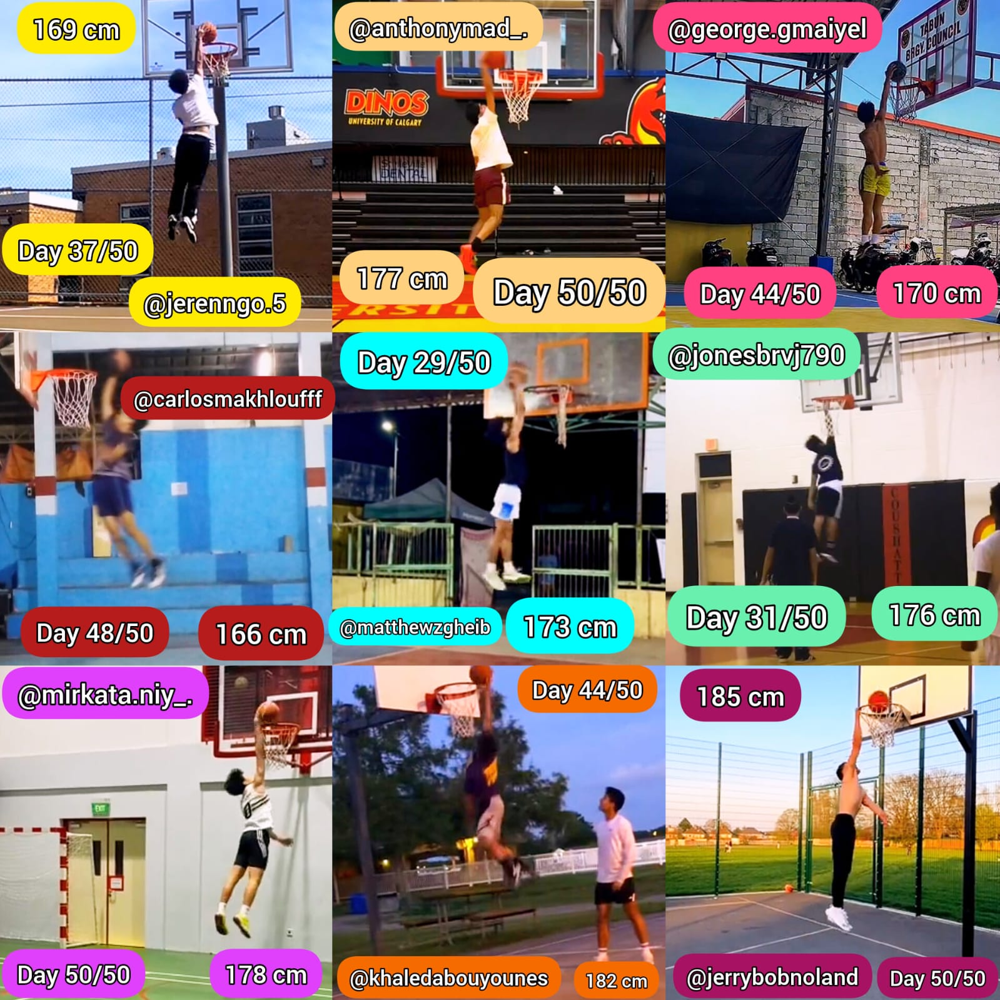
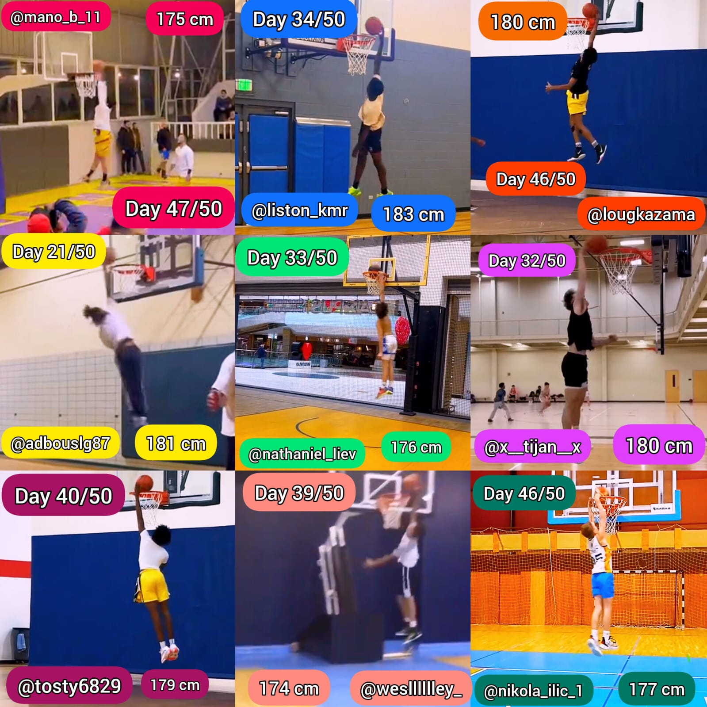
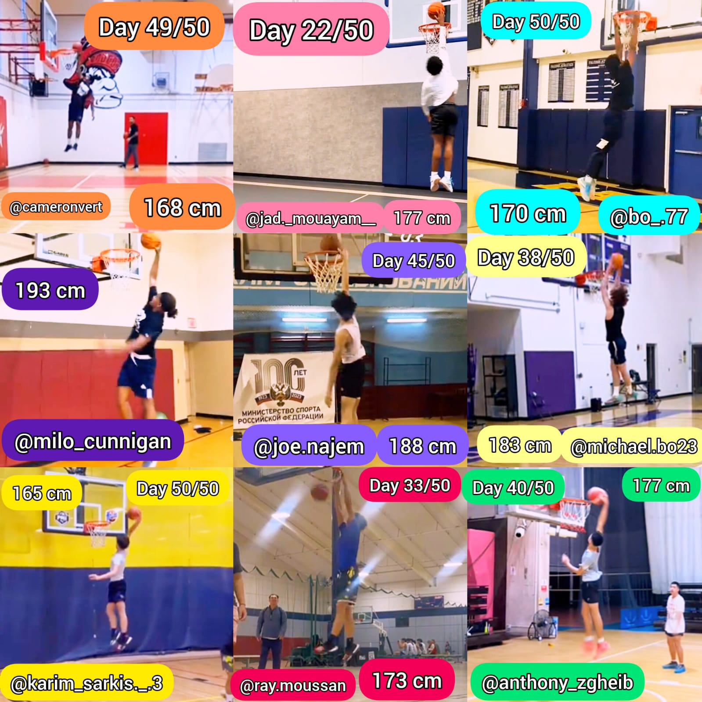
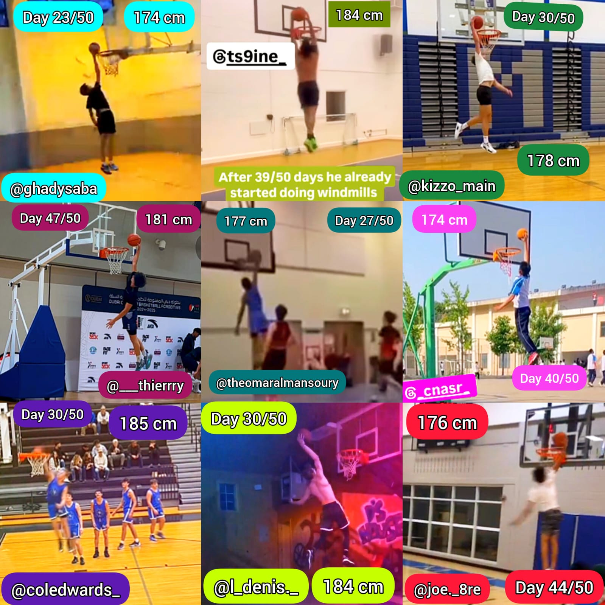

<html lang="en">
<head>  
  <meta charset="UTF-8"/>
  <meta name="viewport" content="width=device-width, initial-scale=1"/>
  <title>Wanna Dunk in 50 Days?</title>
  
</head>
<body>
  

    
    <!-- HERO -->
    <section class="hero">
      <h1>✨ Wanna Dunk in 50 Days? ✨</h1>
      
This 50-day, tendon-focused plan helped 500+ athletes gain 6–9" of vertical. No gym. No fluff. Just bounce.

      <a class="btn" href="https://www.paypal.me/wartiwarkasabian/55" target="_blank">
        🚀 Unlock My Plan – $55
      </a>
      <a class="btn" href="https://wa.me/96171909426?text=Unlock%20my%2050-day%20jump%20plan%20now" target="_blank">
        💬 Text Me on WhatsApp
      </a>
      <a class="btn" href="https://www.instagram.com/direct/inbox/?username=hrairing" target="_blank">
        📩 DM “DUNK” on Instagram
      </a>
    </section>

    <!-- PROGRAM OVERVIEW -->
    

      

        <h2>🔥 Program Overview</h2>
        <ul>
          <li>50-Day Plan: Typical +6–9"</li>
          <li>3 Sessions/Week — Home Only</li>
          <li>No Gym • No Equipment • 50min Max</li>
          <li>Elastic-Fiber + Tendon System</li>
          <li>My 3-Step Bounce Blueprint</li>
          <li>500+ Athletes Transformed</li>
        </ul>
        <a class="btn" href="https://wa.me/96171909426?text=Send%20me%20the%20program%20overview" target="_blank">
          🔍 See Full Overview
        </a>
      

      

        <h2>✅ What’s Included</h2>
        <ul>
          <li>Full 50-Day Training Guide</li>
          <li>Stretch & Recovery Protocols</li>
          <li>Starter Drills for Instant Gains</li>
          <li>20 Bonus Equipment Drills</li>
          <li>Lifetime Access + Video Breakdowns</li>
          <li>100% Results Guarantee</li>
        </ul>
        <a class="btn" href="https://wa.me/96171909426?text=I%27m%20ready%20for%20the%20details" target="_blank">
          📦 Claim My Spot
        </a>
      

    

    <!-- QUICK CONSULTATION -->
    

      <h2>🤔 Need Help Deciding?</h2>
      
Book a free 5-minute consult—no strings attached.

      <a class="btn" href="https://wa.me/96171909426?text=I%20want%20a%20free%20consult" target="_blank">
        📆 Book Consult
      </a>
    

    <!-- TESTIMONIAL GRID -->
    

      
      
      
      
    

    <a class="btn" href="https://wa.me/96171909426?text=I%20saw%20the%20results%20-%20send%20me%20the%20plan" target="_blank" style="margin-bottom:30px;">
      ⭐ I Want These Results
    </a>

    <!-- FAQ -->
    <section class="faq">
      <h3>❓ FAQ</h3>
      
<strong>Do I need a gym?</strong> NO 🏠

      
<strong>Working for beginners?</strong> YES 🙌

      
<strong>When see gains?</strong> 2–3 weeks ⚡

      
<strong>Session length?</strong> 50min max ⏱️

      
<strong>Who’s it for?</strong> Ages 13–17+, all levels

      
<strong>Personal coaching?</strong> YES (video check-ins + DM support)

      

        Still have questions? 
        <a class="btn" href="https://www.instagram.com/direct/inbox/?username=hrairing" target="_blank">
          📩 Ask Me Anything
        </a>
      

    </section>

    <!-- FINAL PAYPAL CTA -->
    <section style="margin:40px 0;">
      <a class="btn" href="https://www.paypal.me/wartiwarkasabian/55" target="_blank">
        🚀 Unlock My Jump Plan – $55 Now
      </a>
    </section>

    <!-- CONTACT FOOTER -->
    <section style="margin:20px 0;">
      
Questions? WhatsApp: <strong>+96171909426</strong> Instagram: <strong>@hrairing</strong>

    </section>

  

</body>
</html>
